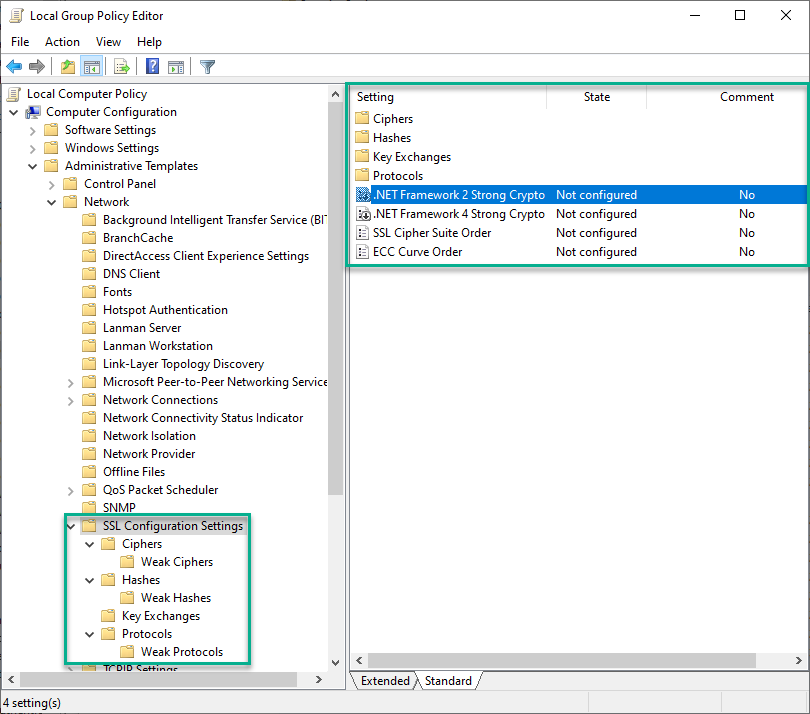

# Group Policy Template for Schannel

I really like Nartac Software's [IIS Crypto][IISCrypto] tool for
configuring protocols, ciphers, hashes and key exchange algorithms on
Windows.  However, since the tool simply makes changes to the local
machine's registry it still requires a bit of work if you want to roll
out these changes to multiple machines.  Sure, you could use IIS Crypto
on a single machine, export the registry keys, then import them via a
startup script GPO, but I wanted a more Group Policy-integrated way to
enable or disable things.  So I created an administrative template for
Group Policy to do just that.

***Note**: I no longer maintain Windows servers for my job, so this may
be out of date. If you notice something that needs to be updated, please
submit an issue or a pull request!*

# What Does it Do?
This template simply twiddles values under the registry key
`HKLM\CurrentControlSet\Control\SecurityProviders\Schannel`.

Note that since that key does not reside under the
_[Policies][policies]_ key, using this template will "tattoo" the
settings onto the registry.  In other words, removing the policy will
**not** revert these settings to their previous values.

# Installation

From MSDN's [Managing Group Policy ADMX Files Step-by-Step Guide][admx_install],
there are two ways to install custom administrative templates.

## Local Installation
* Copy the language-neutral ADMX file(s) to `%SYSTEMROOT%\PolicyDefinitions`.
* Copy the language-specific ADML file(s) to `%SYSTEMROOT%\PolicyDefinitions\[MUIculture]`
  (for example, the U.S. English ADMX language specific file will be
  stored in `%SYSTEMROOT%\policyDefinitions\en-us`.)

You will then be able to use the template on your local workstation to
create and edit local or domain policies, but the template will not be
available to other administrators.  A better option is to install the
template files in the domain's central store.

## Installation in the Central Store

To make the template available automatically to all Group Policy
administrators in a domain, perform the following on a domain
controller:
* Copy the language-neutral ADMX file(s) to `%SYSTEMROOOT%\sysvol\domain\policies\PolicyDefinitions`.
* Copy the language-specific ADML file(s) to `%SYSTEMROOOT%\sysvol\domain\policies\PolicyDefinitions\[MUIculture]`
  (for example, the U.S. English ADMX language specific file will be
  stored in
  `%SYSTEMROOOT%\sysvol\domain\policies\PolicyDefinitions\en-us`.)

# Usage

The new policy settings are located in the same place one would normally
configure the SSL Cipher Suite order; namely:

    Computer Configuration/Administrative Templates/Network/SSL Configuration

Screenshot:

# Available Policy Settings
Any of the following ciphers, hash algorithms, or key exchange algorithms can be
enabled or disabled globally.  The protocols can be independently configured
for both client and server use.  Note that changes to the ciphers and
hashes (and presumably, to the key exchange algorithms) will take effect
immediately when the group policy is applied.  Changes to protocols
require a restart of the computer.

## Ciphers
* [Triple DES 168](https://en.wikipedia.org/wiki/Triple_DES)
* [AES 128/128](https://en.wikipedia.org/wiki/Advanced_Encryption_Standard)
* [AES 256/256](https://en.wikipedia.org/wiki/Advanced_Encryption_Standard)

### Ciphers\Weak Ciphers
* [NULL](https://en.wikipedia.org/wiki/Null_encryption)
* [DES 56/56](https://en.wikipedia.org/wiki/Data_Encryption_Standard)
* [RC2 40/128](https://en.wikipedia.org/wiki/RC2)
* [RC2 56/128](https://en.wikipedia.org/wiki/RC2)
* [RC2 128/128](https://en.wikipedia.org/wiki/RC2)
* [RC4 40/128](https://en.wikipedia.org/wiki/RC4)
* [RC4 56/128](https://en.wikipedia.org/wiki/RC4)
* [RC4 64/128](https://en.wikipedia.org/wiki/RC4)
* [RC4 128/128](https://en.wikipedia.org/wiki/RC4)

## Hash Algorithms
* [MD5](https://en.wikipedia.org/wiki/MD5)
* [SHA](https://en.wikipedia.org/wiki/SHA-1) (also called "SHA-1")
* [SHA-256](https://en.wikipedia.org/wiki/SHA-2)
* [SHA-384](https://en.wikipedia.org/wiki/SHA-2)
* [SHA-512](https://en.wikipedia.org/wiki/SHA-2)

## Key Exchange Algorithms
* [Diffie-Hellman (DH)](https://en.wikipedia.org/wiki/Diffie–Hellman_key_exchange)
* [PKCS](https://en.wikipedia.org/wiki/PKCS)
* [Elliptic-Curve Diffie-Hellman (ECDH)](https://en.wikipedia.org/wiki/Elliptic_curve_Diffie–Hellman)

## Protocols
* [TLS 1.0](https://en.wikipedia.org/wiki/Transport_Layer_Security#TLS_1.0)
* [TLS 1.1](https://en.wikipedia.org/wiki/Transport_Layer_Security#TLS_1.1)
* [TLS 1.2](https://en.wikipedia.org/wiki/Transport_Layer_Security#TLS_1.2)

### Protocols\Weak Protocols
* Multi-Protocol Unified Hello
* [PCT 1.0](https://en.wikipedia.org/wiki/Private_Communications_Technology)
* [SSL 2.0](https://en.wikipedia.org/wiki/Transport_Layer_Security#SSL_1.0.2C_2.0_and_3.0)
* [SSL 3.0](https://en.wikipedia.org/wiki/Transport_Layer_Security#SSL_1.0.2C_2.0_and_3.0)

## Cipher Suite Order
Setting the cipher suite order (the second half of IIS Crypto) for
Windows involves configuring a Microsoft-delivered group policy setting.
See [Prioritizing Schannel Cipher Suites][cipherorder] for more
information.  (Note this line on that page, however:  "The list of
cipher suites is limited to 1023 characters."  So you can't go nuts with
this GPO like you can if you set the registry key outright, but the GPO
is certainly easier to deploy.)  There are a few ways you can build your
cipher suite list.

* Use IIS Crypto as a guide.  Start the tool, click the "Best Practices"
  button, and copy down what it gives you.
* Use [Steve Gibson's list][grclist].  Just copy that list, remove
  the line breaks, and paste it into the GPO setting.
* Roll your own.

Once you've got your list, add it to your GPO and roll it out!

# Resources
* [SSL Labs' SSL/TLS Deployment Best Practices][ssllabs]
* [TLS Cipher Suites in Windows Server 2003 and XP][xp_tls]
* [SSL Cipher Suites in Windows Server 2003 and XP][xp_ssl]
* [Schannel Cipher Suites in Windows Server 2008 and Vista][vista]
* [Schannel Cipher Suites in Windows Server 2008 R2 and above][2008r2]
* [How to restrict the use of certain cryptographic algorithms and protocols in Schannel.dll][restrict_usage]
* [Managing Group Policy ADMX Files Step-by-Step Guide][admx_install]

[IISCrypto]: https://www.nartac.com/Products/IISCrypto
[policies]: https://msdn.microsoft.com/en-us/library/aa374292(v=vs.85).aspx
[admx_install]:https://msdn.microsoft.com/en-us/library/bb530196.aspx
[cipherorder]:https://msdn.microsoft.com/en-us/library/windows/desktop/bb870930(v=vs.85).aspx
[grclist]:https://www.grc.com/miscfiles/SChannel_Cipher_Suites.txt
[ssllabs]:https://www.ssllabs.com/projects/best-practices/index.html
[xp_tls]: https://msdn.microsoft.com/en-us/library/windows/desktop/aa380512(v=vs.85).aspx
[xp_ssl]: https://msdn.microsoft.com/en-us/library/windows/desktop/aa380124(v=vs.85).aspx
[vista]: https://msdn.microsoft.com/en-us/library/windows/desktop/ff468651(v=vs.85).aspx
[2008r2]: https://msdn.microsoft.com/en-us/library/windows/desktop/aa374757(v=vs.85).aspx
[restrict_usage]: https://support.microsoft.com/en-us/kb/245030
